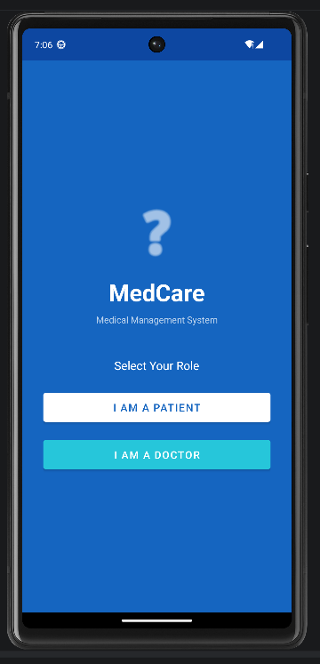
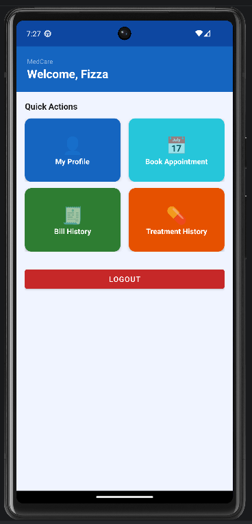
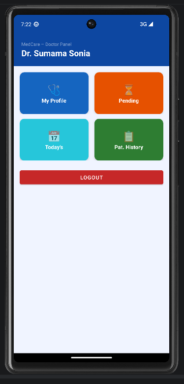
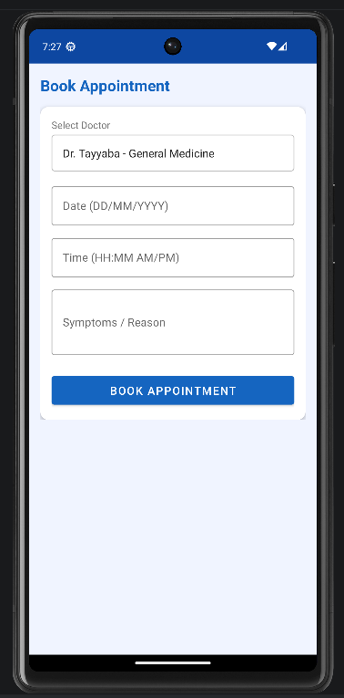
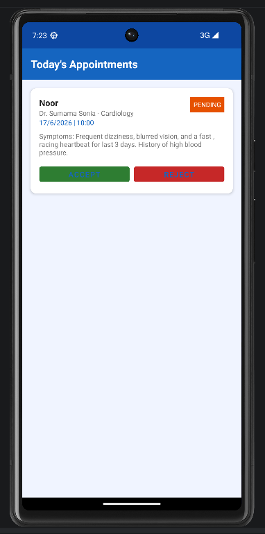
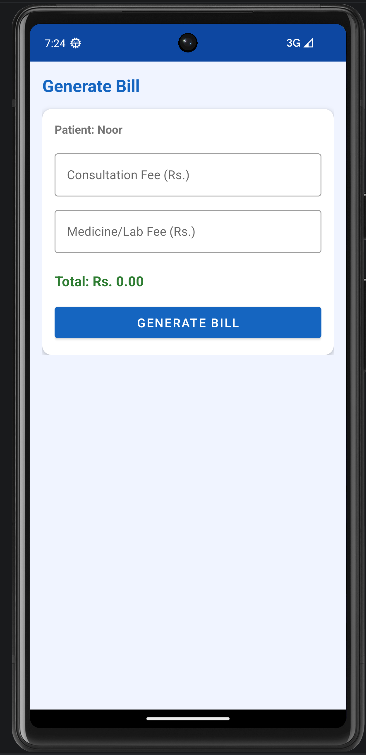

# 🏥 MedCare – Medical Management System

<p align="center">
  
  
  
  
  
</p>

<p align="center">
  A full-featured Android application for managing medical appointments, treatment records, and billing — built for both Patients and Doctors.
</p>

---

## 📱 Screenshots

> _Add your screenshots here after uploading them to the repo_

| Role Select | Patient Dashboard | Doctor Dashboard |
|:-----------:|:-----------------:|:----------------:|
|  |  |  |

| Book Appointment | Today's Appointments | Generate Bill |
|:----------------:|:--------------------:|:-------------:|
|  |  |  |

---

## ✨ Features

### 👤 Patient
| Feature | Description |
|---------|-------------|
| 📝 Registration & Login | Create a new patient account securely via Firebase Auth |
| 👤 View Profile | View personal details — name, age, gender, phone, address |
| 📅 Book Appointment | Select a doctor, pick a date & time, describe symptoms |
| 🧾 Bill History | View bills from all completed appointments |
| 💊 Treatment History | View prescription, disease, and progress from past visits |

### 🩺 Doctor
| Feature | Description |
|---------|-------------|
| 🩺 Doctor Profile | View personal profile and specialization |
| ⏳ Pending Appointments | See all appointments waiting for action |
| 📅 Today's Appointments | View today's schedule — Accept or Reject each appointment |
| 📋 Update Treatment | Add disease diagnosis, prescription, and progress notes |
| 💰 Generate Bill | Create itemized bills with consultation and medicine fees |
| 📁 Patient History | View treatment records of all previously treated patients |

---

## 🛠️ Tech Stack

| Technology | Purpose |
|------------|---------|
| **Java** | Primary programming language |
| **XML** | UI layouts |
| **Firebase Authentication** | Secure login and registration |
| **Firebase Realtime Database** | Cloud data storage and sync |
| **Material Design Components** | Modern UI (Cards, TextInputLayout, Buttons) |
| **RecyclerView** | Efficient list rendering |
| **Android DatePickerDialog** | Date selection for appointments |
| **Android TimePickerDialog** | Time selection for appointments |

---

## 🗂️ Project Structure

```
MedicalManagementSystem/
│
├── app/src/main/
│   ├── java/com/example/medicalmanagementsystem/
│   │   │
│   │   ├── MainActivity.java               # Role selection screen
│   │   ├── LoginActivity.java              # Login for patient & doctor
│   │   ├── RegisterActivity.java           # Registration for patient & doctor
│   │   │
│   │   ├── patient/
│   │   │   ├── PatientDashboardActivity.java
│   │   │   ├── PatientProfileActivity.java
│   │   │   ├── BookAppointmentActivity.java
│   │   │   ├── BillHistoryActivity.java
│   │   │   └── TreatmentHistoryActivity.java
│   │   │
│   │   ├── doctor/
│   │   │   ├── DoctorDashboardActivity.java
│   │   │   ├── DoctorProfileActivity.java
│   │   │   ├── PendingAppointmentsActivity.java
│   │   │   ├── TodaysAppointmentsActivity.java
│   │   │   ├── HistoryUpdateActivity.java
│   │   │   ├── GenerateBillActivity.java
│   │   │   ├── PatientHistoryActivity.java
│   │   │   └── AppointmentAdapter.java
│   │   │
│   │   └── model/
│   │       ├── User.java
│   │       ├── Appointment.java
│   │       ├── Bill.java
│   │       └── Treatment.java
│   │
│   └── res/
│       ├── layout/
│       │   ├── activity_main.xml
│       │   ├── activity_login.xml
│       │   ├── activity_register.xml
│       │   ├── activity_patient_dashboard.xml
│       │   ├── activity_patient_profile.xml
│       │   ├── activity_book_appointment.xml
│       │   ├── activity_doctor_dashboard.xml
│       │   ├── activity_history_update.xml
│       │   ├── activity_generate_bill.xml
│       │   ├── activity_list.xml
│       │   ├── item_appointment.xml
│       │   ├── item_bill.xml
│       │   └── item_treatment.xml
│       │
│       ├── values/
│       │   ├── strings.xml
│       │   ├── colors.xml
│       │   └── themes.xml
│       │
│       └── drawable/
│           └── spinner_bg.xml
│
├── google-services.json                    # Firebase config (not pushed to GitHub)
├── build.gradle
└── AndroidManifest.xml
```

---

## 🔥 Firebase Database Structure

```
Firebase Realtime Database
│
├── users/
│   └── {uid}/
│       ├── uid
│       ├── name
│       ├── email
│       ├── phone
│       ├── role          # "patient" or "doctor"
│       ├── age
│       ├── gender
│       ├── specialization
│       └── address
│
├── appointments/
│   └── {appointmentId}/
│       ├── appointmentId
│       ├── patientId
│       ├── doctorId
│       ├── patientName
│       ├── doctorName
│       ├── date
│       ├── time
│       ├── status        # pending / accepted / rejected / completed
│       └── symptoms
│
├── treatments/
│   └── {treatmentId}/
│       ├── treatmentId
│       ├── appointmentId
│       ├── patientId
│       ├── doctorId
│       ├── patientName
│       ├── doctorName
│       ├── disease
│       ├── prescription
│       ├── progress
│       └── date
│
└── bills/
    └── {billId}/
        ├── billId
        ├── appointmentId
        ├── patientId
        ├── doctorId
        ├── patientName
        ├── doctorName
        ├── date
        ├── consultationFee
        ├── medicineFee
        ├── totalAmount
        └── status        # paid / unpaid
```

---

## 🚀 Getting Started

### Prerequisites
- Android Studio (latest version recommended)
- Java JDK 8 or higher
- A Firebase account (free)
- Android device or emulator with API 21+

### Installation

**1. Clone the repository**
```bash
git clone https://github.com/YOUR_USERNAME/MedicalManagementSystem.git
cd MedicalManagementSystem
```

**2. Set up Firebase**
- Go to [Firebase Console](https://console.firebase.google.com)
- Create a new project named `MedicalManagementSystem`
- Add an Android app with package name `com.example.medicalmanagementsystem`
- Download `google-services.json`
- Place it inside the `app/` folder of this project
- Enable **Authentication** → Email/Password
- Enable **Realtime Database** → Start in test mode

**3. Open in Android Studio**
- Open Android Studio
- Click **File** → **Open** → select the cloned folder
- Wait for Gradle to sync

**4. Run the App**
- Connect your Android device via USB (enable USB Debugging)
- Or launch an emulator from Device Manager
- Click the green **▶ Run** button

---

## 🔐 Firebase Security Rules

Set these rules in Firebase Console → Realtime Database → Rules:

```json
{
  "rules": {
    ".read": "auth != null",
    ".write": "auth != null"
  }
}
```

---

## 📋 App Flow

```
Launch App
    │
    ├── Select Role
    │       ├── Patient → Login / Register
    │       └── Doctor  → Login / Register
    │
    ├── Patient Flow
    │       ├── Dashboard
    │       ├── View Profile
    │       ├── Book Appointment (select doctor, date, time, symptoms)
    │       ├── View Bill History
    │       └── View Treatment History
    │
    └── Doctor Flow
            ├── Dashboard
            ├── View Profile
            ├── Pending Appointments
            ├── Today's Appointments → Accept / Reject
            ├── Update Treatment (disease, prescription, progress)
            ├── Generate Bill (consultation + medicine fee)
            └── Patient History (all treated patients)
```

---

## ⚙️ Dependencies

```gradle
// Firebase
implementation platform('com.google.firebase:firebase-bom:32.7.0')
implementation 'com.google.firebase:firebase-auth'
implementation 'com.google.firebase:firebase-database'

// UI
implementation 'androidx.appcompat:appcompat:1.6.1'
implementation 'com.google.android.material:material:1.11.0'
implementation 'androidx.constraintlayout:constraintlayout:2.1.4'
implementation 'androidx.cardview:cardview:1.0.0'
implementation 'androidx.recyclerview:recyclerview:1.3.2'
```

---

## 🤝 Contributing

Contributions are welcome! Here's how:

1. Fork the repository
2. Create a new branch (`git checkout -b feature/YourFeature`)
3. Commit your changes (`git commit -m 'Add YourFeature'`)
4. Push to the branch (`git push origin feature/YourFeature`)
5. Open a Pull Request

---

## 📄 License

This project is licensed under the **MIT License** — see the [LICENSE](LICENSE) file for details.

---

## 👨‍💻 Author

**Your Name**
- GitHub: [@Sumamasonia](https://github.com/Sumamasonia)
- LinkedIn: [SumamaSonia](https://www.linkedin.com/in/sumamasonia/)

---

## 🙏 Acknowledgements

- [Firebase](https://firebase.google.com/) for backend services
- [Material Design](https://material.io/) for UI components
- [Android Developers](https://developer.android.com/) for documentation

---

<p align="center">Made with ❤️ for a better healthcare experience</p>
